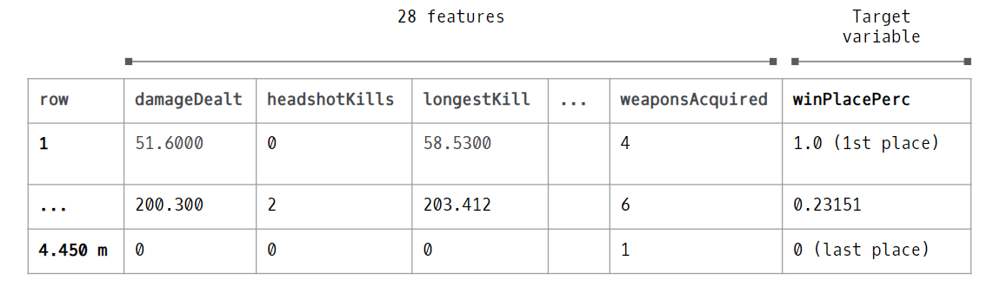
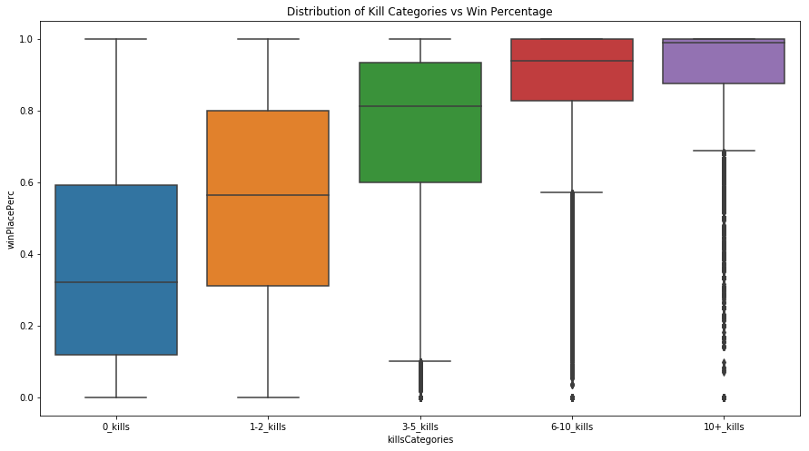
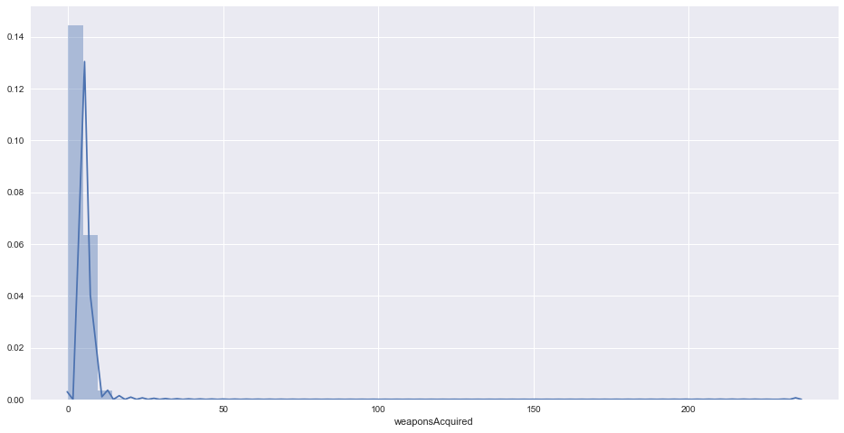
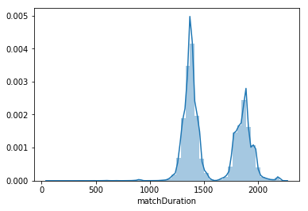
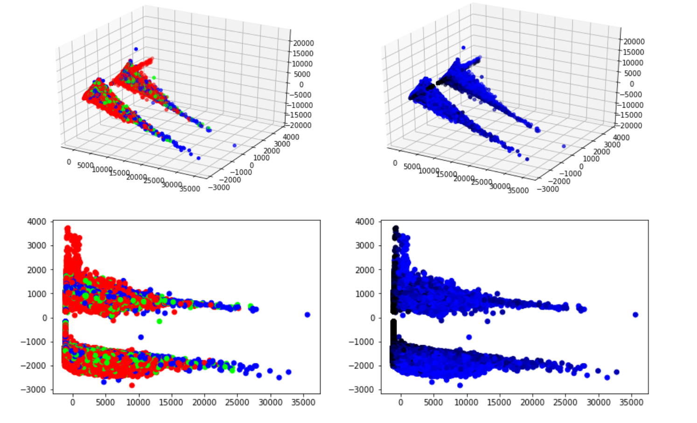
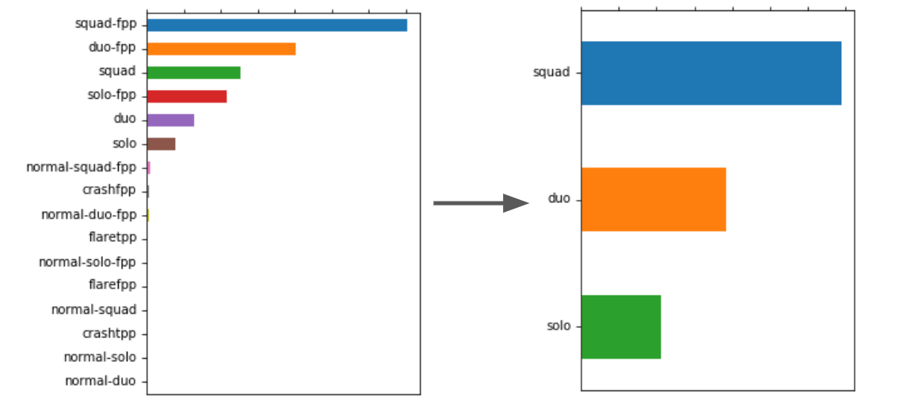
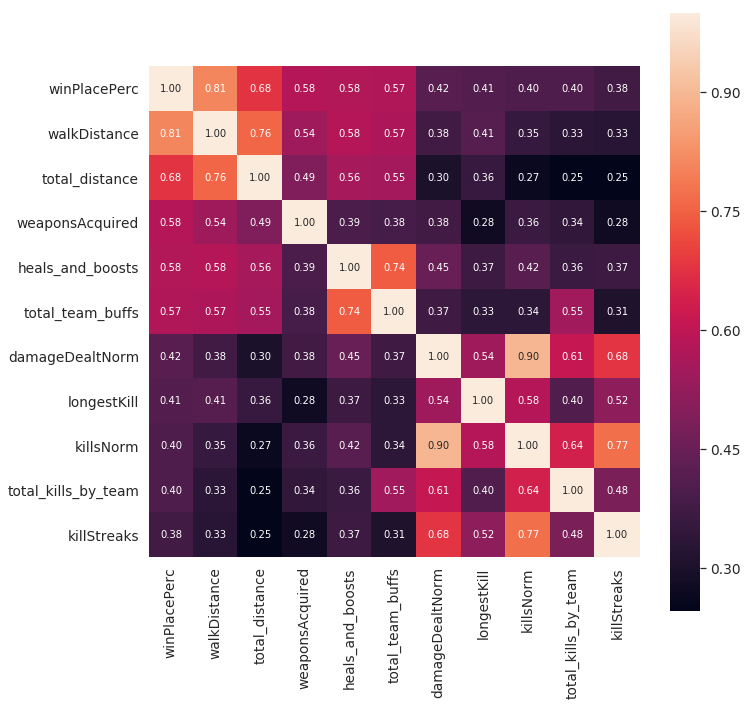
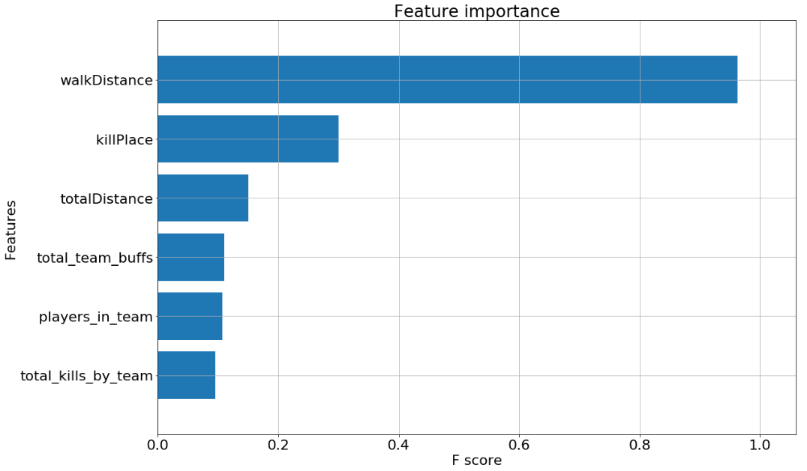
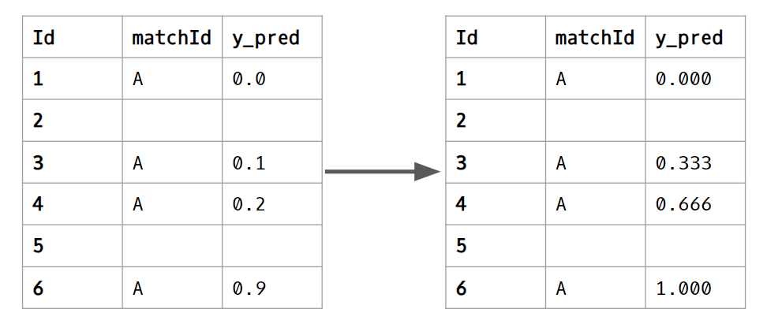

## Introduction
In this report, we will show our approach in exploring and predicting final leaderboard placements in PlayerUnknown’s Battlegrounds matches. We first give background information on the video game and context for the problem. We do exploratory data analysis. Afterwards, we perform feature engineering, creating more insightful features that better predict the target variable. We try a variety of models (simple to complex) for predictions: Linear Regression, Random Forests, Multilayer Perceptrons, and Gradient Boosting LightGBM. We discuss postprocessing of our data to decrease our error. We also discuss the interesting discoveries we made when solving this problem. Finally, we discuss future steps to improve our models.

Code Repository: <https://github.com/CliveUnger/EE460J_Final_Project_PUBG>

### Context
PlayerUnknown's Battlegrounds (PUBG) is a battle royale survival game with the goal of being the last player standing. Up to 100 players are dropped onto an island empty-handed with a variety of game modes that can allow squads of up to 4 people. In the game, a player can find and use a variety of weapons, items, and vehicles. Players must also avoid the shrinking “circle”, which pushes players closer together on the map.

The team at PUBG has made official game data available for the public to explore. Kaggle collected data made possible through the PUBG Developer API.

Kaggle Competition: <https://www.kaggle.com/c/pubg-finish-placement-prediction>

### Motivation
With the growing prevalence of competitive eSports, there is a need for rich user data and analysis for improving skill. By exploring the data, we found valuable insights into the strategies and metrics that yield the best player performance.

**Goal:** Predict final leaderboard placements based on player in-game statistics.

**Application:** Find metrics that correlate with performance.

## Exploration
### Dataset
You are given over 65,000 games worth of anonymized player data, split into training and testing sets, and asked to predict final placement from final in-game stats and initial player ratings.

The target is “a percentile winning placement, where 1 corresponds to 1st place, and 0 corresponds to last place in the match. It is calculated off of maxPlace, not numGroups, so it is possible to have missing chunks in a match.”

The dataset has 4.45 million rows of training data and 1.93 million rows of test.
Since the data was so large, memory usage became an issue.
We utilized memory reduction techniques to downcast data types resulting in a 75% memory reduction.
This was extracted from a public kernel: <https://www.kaggle.com/chocozzz/how-to-save-time-and-memory-with-big-datasets>

The data also has some issues with missing values and at one point, a data leak occurred where the target variable was predictable directly from the row ID.

### Outlier Detection & Anomalies
No dataset is ever 100% clean and this competition is no different.

Some of the data does not reflect the core gameplay because it is drawn from custom game modes or because it has cheaters. Some of the characteristics of this anomalous data include the following:

* Many kills without moving
* Many roadkills while driving a very short distance
* Suspiciously high number of kills
* Suspiciously long range kills

We could argue both ways for whether to drop this data or not; however, hackers and custom games exist in the test set, so we decided that it is valuable information when training our models.

**Corrupt Data:**
Due to issues with the API, there is a bug with the groupID column. When a player leaves a match and rejoins, their groupID is reassigned, which causes the creation of larger groups than a gamemode would allow. A squad match only allows 4 people per team, meaning per team, there should be at most 4 of the same groupID’s. But because of the bug, we found examples violating this rule in the data. This creates issues when creating team related features as it makes distinguishing teams difficult.

**Useless Data:**
Some features like matchId is only useful for feature extraction such as for finding total players in a match. Because matchId is a hex identifier string, it is not ordinal and has very high unique value count, so we cannot one hot encode it as a categorical. We also found that matchID has very little predictive performance on its own.

### Exploratory Data Analysis
The first thing we explored was how common features influenced the win percentage placement (our target variable). Some correlated features that we found were number of boosts and number of heals in addition to others. As shown below by the increasing mean of win percentage placement, we found that kill count was correlated with our target variable, which makes sense because more kills usually means a player is better skilled and will rank closer to the top.

When trying to identify cheaters, we looked at distributions of some features so we could get a better understanding for what anomalies in the data looked like. For example, most players picked up between zero and eight weapons in a match, as can be seen by the distribution below. However, when we found players that picked up 40+ weapons, we attributed that to them either cheating or playing a custom game. To better confirm if a player was cheating, we would have to look at other features in addition to weapons picked up.

Another interesting finding was the distribution of the match duration, as it is bimodal shown below. We tried to discover what caused this phenomenon, but could not identify any single influence. For example we looked at how different game modes changed the distribution, but it had little effect. We also tried looking at third person vs first person perspective modes in addition to how many players are in a match, but nothing significantly revealed new insight.

We also performed PCA on the training data after dropping unnecessary features (such as match duration, group id, match id, and match type). It produced some interesting clustering results which we tried to understand by grouping the information. For the graphs with the red, blue, and green dots, we split up the data into squad, duo, and single game modes respectively. For the black to blue color gradient plot, the closer the point is to black, the lower the win percentage, and the closer the point is to blue, the higher the win percentage. Unfortunately, this didn’t reveal any obvious signs of clustering due to game type or win percentage.

So, the next thing we tried was moving down another dimension into 2D and performing the same steps; however, we couldn’t make any sense of these two plots either. In the future, I would plot histograms of the different features to see if there are any bimodal distributions. Because we saw some clear clustering using PCA, looking for bimodal distributions could be useful when trying to figure out what is causing this phenomenon.

### Shortcomings in our data
Since the statistics for each observation are based on end game stats, there are many in-game nuances that cannot be captured in the dataset. For example, skillful outplays against opponents like the gif below would be difficult to express as data.

In addition, our EDA could be bolstered with additional features that the original PUBG developer API key provides. For example, we can scrape landing positional data and zone positional data, which would be insightful for figuring out pathing strategies. Having the different types of weapons picked up as well as loot positions can be influential factors, especially since players start with no weapons at the beginning of a match.

## Feature Engineering & Preprocessing
Engineering new features was a primary focus of this project. Experience playing the game definitely guided intuitions for what new features could influence winning.

We started by looking at the different game modes. The dataset contains sixteen different game modes, but all of them are variations of the core three types: squad, duo, solo. As a result, we mapped the sixteen game modes to the core three as shown in the figure below.

Next, we looked at adding new features that better capture the strength of a player during a match. We have listed all of the features added and their descriptions:

**Normalized features** based on number of players in match. The idea is that kills in a 75 person match will be more impactful than kills in a 100 person match

|    New feature    | Description                                                 |
|-------------------|-------------------------------------------------------------|
| players_joined    | Players in match                                            |
| killsNorm         | Kills / players in game                                     |
| damageDealtNorm   | Damage dealt / players * health                             |
| pct_knocked       | Percent of total knocks in the match that the   player gets |
| pct_kills_by_team | Percent of total kills by the team                          |

**Other added features:**

|    New feature         | Description                                                                                                   |
|------------------------|---------------------------------------------------------------------------------------------------------------|
| players_in_team:       | Number of players in team (based on groupId)                                                                  |
| team_fill_percentage:  | Team fill percentage (if playing squads and only   2/4 players in squad, the team could be at a disadvantage) |
| heals_and_boosts:      | Self heals + self boosts                                                                                      |
| total_items_acquired:  | Self heals + self boosts + weapons picked up                                                                  |
| headshots_kill_rate:   | headshotKills / kills                                                                                         |
| kill_place_perc        | killPlace / maxPlace                                                                                          |
| teamwork               | Assists + revives                                                                                             |
| total_distance         | walkDistance + rideDistance + swimDistance                                                                    |
| kills_without_moving   | boolean , if the player got kills without moving                                                              |
| boostsPerWalkDistance  | Boosts / walk distance                                                                                        |
| healsPerWalkDistance   | Heals / walk distance                                                                                         |
| killsPerWalkDistance   | Kills / walk distance                                                                                         |
| total_damage_by_team   | Total damage done by player’s team                                                                            |
| total_kills_by_team    | Total kills done by player’s team                                                                             |
| total_team_buffs       | Total heals and boosts used by player’s team                                                                  |
| afk                    | (boolean) Players that do nothing                                                                             |
| cheater                | (boolean) players that perform questionable   actions.                                                        |

 
After adding new features, some of the original features were removed since they were redundant or unnecessary such as:
* rank Point
* killsPoints
* winPoint
* matchId
* groupId
* matchType
* Remove features that were normalized

Finally, here is the correlation matrix of the top 10 features that correlate with the target after all of the feature engineering:

## Base Machine Learning Models

### Loss Function
Mean Absolute Error (MAE) measures the average magnitude of the errors in a set of predictions, without considering their direction.

For example, a MAE of 0.04 signifies that the average magnitude difference from the prediction to the true value is 0.04. In context of our dataset, this would typically mean that the average error is off by 4 placements. This loss functions provides an appropriate measure of our model prediction accuracy.

### Models

#### Linear Regression: public score - 0.0445

In our modeling process, we wanted to start off with a basic model to have a benchmark for more complex models. We decided to try Linear Regression to see if a simple linear relationship could predict effectively for our problem.

Linear Regression becomes inaccurate when many outliers are present in the data, so the first step was to remove these. In our data analysis, we managed to identify outliers like cheaters and custom game modes which made removing these outliers easier. Many of the features we had were also heavily skewed. For example, the distribution of damage done for a player peaks at 0 and decreases as the damage done increases. After deskewing these features, we finally had our data properly formatted to run Linear Regression.

Training on the whole dataset, we were able to get a public score of 0.0445. Although this model did not perform very well, we still wanted to see what features the model valued when making predictions. From the below chart, we can see that boosts and heals were the most important features. Three of the top six most important features were also created by us in the feature engineering step, reinforcing that our feature engineering was providing value.

#### Random Forest: public score - 0.0430

After Linear Regression, we decided to try another simple model. We speculated that Random Forest would perform better given that the model does not rely on the assumption that a player’s rank is a linear combination of the inputs. Random Forest is as a result able to discover more complex dependencies at the cost of more time for fitting than normal Linear Regression. This model gave us an improvement, but not much. Generally, bagging decision tree models like this one have been helped by boosting in the past. For a more complex model, we decided we would try XGBoost or LightGBM to see if this would improve our score. Boosting tree models also seem to work well with numerical and continuous numbers, which is entirely what our training set.

#### Multilayer Perceptron: public score - 0.0224

Since we had so much data available (~4.5 million rows in the training set), we decided to try building a basic neural network or multilayer perceptron.

We experimentally found that ReLu activation and fully connected layers tended to work well. We also saw that the experimental activation function a2m2l worked well too. Since ReLu is more standard and performance seemed similar, we decided to go with ReLu for our final MLP.

Three hidden layers seemed to work the best for us as well. Originally, we had 28 neurons in each layer, but some tuning revealed that 32 neurons worked a bit better. There are many parameters part of the neural net architecture that can be tuned. Due to the large amount of data, the training time for each version of a neural network took a long time to train. As a result, we were only able to try a few parameters here. In the future, we would like to spend more time trying various parameters and researching how to optimally tune a neural network.

With our tuned neural network, we received a public score of 0.0224. This was a huge improvement! However, we think more tuning could improve the performance. Regardless, the performance of the neural network might be hampered by the fact that most of the variables are numbers and continuous. As a result, this model may not be the best for this problem.

Other neural network approaches we considered were CNNs, RNNs, and LSTMs. Some research showed the CNNs worked well in cases where spatial awareness was important. Since our data was one dimensional and lacked structure, we thought this was not appropriate. RNNs and LSTMs seem to work well for cases where memory or context is important to solving the problem. Since each row was independent of the others and we were not dealing with text or time-series data, this did not seem to be a good case for our problem either.

We also wanted to take a look at what features the MLP valued when making decisions. The below graph shows the feature importances of the six most important features for our MLP. All of the features flagged as important are different than the features marked by Linear Regression. In some sense, this is not surprising because multilayer perceptrons are very different and much more complicated than Linear Regression models. Even in this case, the majority of features deemed important by the MLP were features we constructed. This once again shows that our feature engineering did help our model.

Below are the feature importances for the MLP:

#### LightGBM: public score -  0.0205

LightGBM was our gradient boosting model of choice for this dataset. We found that this worked best since LGBM creates strong classifiers from many decision trees. The key benefit of LGBM to typical XGBoost is that LGBM uses histogram-based algorithms, which bucket continuous features into discrete bins. During training, splitting on leaves become much faster, improving the time complexity by many fold (From our testing, we found LGBM 7x faster than XGBoost).

To prevent overfitting, we need to found optimal parameters for num_leaves = 31 and bagging_fraction = 0.7. The num_leaves parameter prevents the tree from growing too large and overfitting, since it uses a best-first approach (potentially leading to unbalanced trees). Adding a bagging_fration allows the leaf to split against 70% of randomly sampled data. These parameters help speed up training by adding constraints to the tree growth and reducing the amount of data points used in each iteration.

This feature importance graph displays the top 6 features of our boosting model. The top two features - walkDistance and killPlace - make sense. People who have a longer walk distance would be alive longer, which is akin to having a higher win placement percentage. The player’s kill place (kill count leaderboard placement) clearly correlates to final placement; having more kills means having a higher placement. The next 4 features were feature engineered, demonstrating the reliability of these features as measures for performance.

### Post Processing
In this competition, we only care about the relative ranking of players in the same match.
If the data only contains a subset of all players in the match, the correct rankings go from relative 1st place to relative last place. 1 -> 0.
By taking the relative ranking of all players in the same match and distributing them evenly between 0 and 1, we improved our score.
This was extracted from a public kernel: <https://www.kaggle.com/ceshine/a-simple-post-processing-trick-lb-0237-0204>

## Future Steps
The team approached this PUBG dataset with a focus on exploratory data analysis and feature engineering. Since we had domain knowledge regarding the topic, we could find interesting trends and create better features that represented the data. Given more time, we would ensemble high performing models and do more extensive hyper parameter tuning for better results. We knew given enough time and resources, we would yield a much higher result.

Since the kaggle competition provided a substantial dataset, we decided to use this data. Given more time, we would like to scrape our own data using the PUBG developer API key. This information contains more valuable features such as starting position and the different types of weapons used. This additional information can augment our predictive models and we would be able to discover more interesting strategies.

## Conclusion
Running different models, we learned that LightGBM and gradient boosting models still typically yield the best results for regression type problems. This follows with the trend that Gradient Boosting wins Kaggle competitions. In addition, we found that creating new features that better represent player metrics improved the overall prediction scores.  Lastly, our models could have been more optimally tuned for better scores; however, given the time constraints and substantial dataset, we decided to focus our efforts of EDA, Feature engineering, and finding interesting qualities in the data.

## References
We contribute a lot of our inspiration from the public kernels for this competition. Here are some of the kernels that were especially helpful in our learning process:

<https://www.kaggle.com/carlolepelaars/pubg-data-exploration-rf-funny-gifs>

<https://www.kaggle.com/deffro/eda-is-fun>
